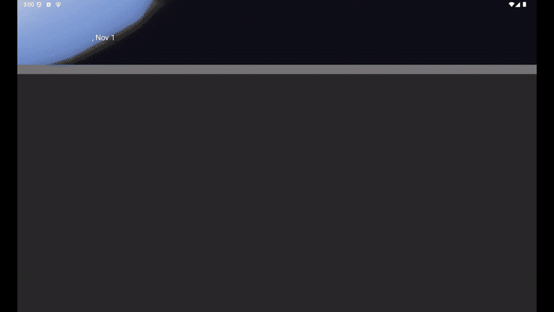
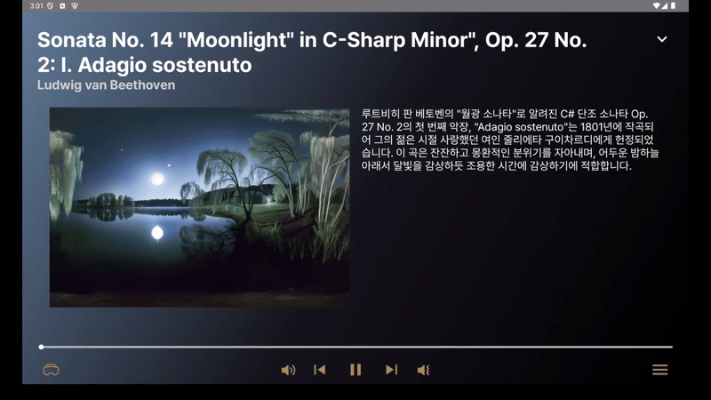
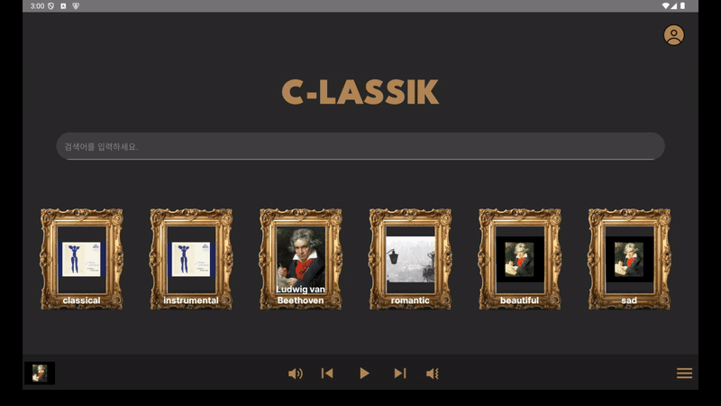
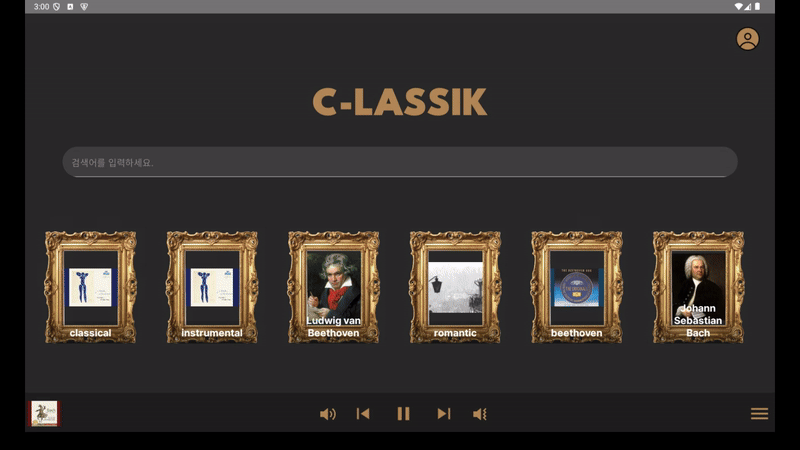
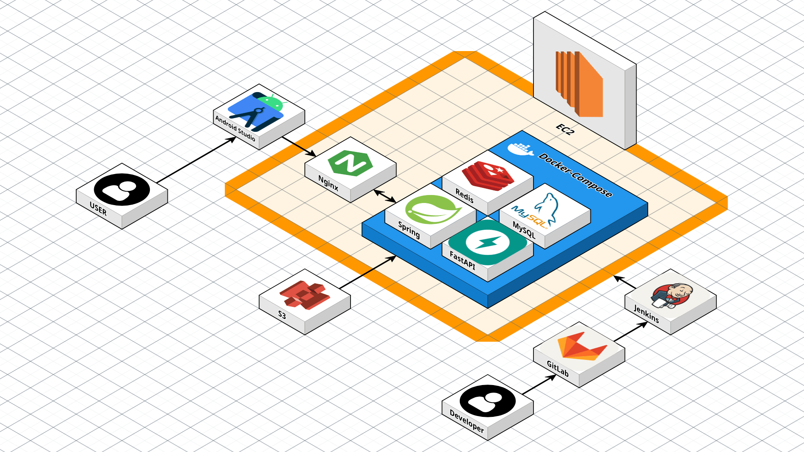

# C-LASSIK (클라식)

## 📌 프로젝트 소개

C-LASSIK은 공감각적 클래식 음악 감상을 위한 VR 음악 스트리밍 서비스입니다.

청각, 시각, 촉각을 사용하여 비장애인뿐만 아니라 청각장애인도 음악을 즐길 수 있도록 유니버셜 컨텐츠를 제공합니다.

[🎞 UCC 보러가기 →](https://www.youtube.com/watch?v=NCk-aZTwF6Y)

[📲 Apk 파일 다운받기 →](https://drive.google.com/file/d/1gL74tvTDfhlvfF8H5q-r5zsSZZ4ZwIL1/view?usp=sharing)

## 💻 프로젝트 주요 기능

### 💯 음악을 100% 즐기기

클래식 음악은 다른 장르에 비해 음악을 듣는 동시에 정보를 즐기기가 어렵습니다. 클라식은 클래식 음악의 세부 정보를 함께 제공하여 감상을 더욱 풍부하게 합니다.

### 👀 음악을 시각으로 즐기기

Skybox AI를 이용해 해당 클래식 음악에 맞는 정보로 VR 이미지를 생성하여 제공합니다.

### 👋 음악을 촉각으로 즐기기

librosa 라이브러리를 사용하여 음악의 frequency를 수치화하고 셈여림 데이터를 haptic으로 표현하여 제공합니다.

### 🧡 음악을 취향대로 즐기기

사용자가 재생한 시청 기록 기반으로 취향에 맞는 추천 플레이리스트를 제공합니다.

### 😎 음악을 원하는대로 즐기기

사용자가 생성한 플레이리스트에 원하는 음악을 저장하고 해당 플레이리스트에 저장된 곡만 즐길 수 있도록 커스텀 플레이리스트를 제공합니다.

## 🎼 주요 기술 소개

### 🔎 검색

Track 데이터를 벡터화하여 ChromaDB에 저장하고, 검색어를 벡터화해 유사 키워드 상위 20개를 추출할 수 있도록 설계했습니다. 또한, GPT-4o 모델을 통해 검색어의 오탈자를 보정하여 최적화된 검색 결과를 제공합니다.

### 👁‍🗨 음악 시각화

음악 제목을 기반으로 OpenAI 모델에서 생성된 프롬프트를 활용해 Skybox API로 파노라마 이미지를 생성하고, 이를 S3에 저장한 뒤 관련 메타데이터를 데이터베이스에 연동합니다. OpenAI, 이미지 생성 기술, 클라우드 스토리지를 통합해 효율적인 데이터 관리와 이미지 제공을 구현했습니다.

#### 파노라마 asset 결과

### 🎯 추천 플레이리스트

사용자의 Track 재생 기록 데이터를 기반으로 10개의 플레이리스트를 추천합니다. 만약 데이터가 부족하다면 무작위 작곡가에 대한 플레이 리스트를 반환합니다.

#### 추천 기능 동작 과정

1. Redis에 저장된 사용자의 재생 기록 Data를 가져온다.
2. Track 작곡가 & Tag 정보와 HashMap을 활용해 순위를 구한다.
3. 상위 10개에 대해 알맞은 Track List를 반환한다.

## 🛠 기술 스택

### 🖥️ Client

|                 |                                                                                                                                                                                                                                     |
| :-------------- | :---------------------------------------------------------------------------------------------------------------------------------------------------------------------------------------------------------------------------------- |
| Framework       |                                                                                                               |
| Language        |                      |
| Version Control |                             |
| IDE             |   |

### 🖥️ Server

|                 |                                                                                                                                                                                                                                                                                                                                                            |
| :-------------: | :--------------------------------------------------------------------------------------------------------------------------------------------------------------------------------------------------------------------------------------------------------------------------------------------------------------------------------------------------------- |
|    Framework    |                                                                                                                                    |
|    Language     |                         |
|    Database     |    |
|      Cloud      |                                                                                                                          |
|     DevOps      |                                                                                                                   |
|       AI        |                                                                                                                                                                                                                                                 |
|    Crawling     |                                                                                                                                                                                                                                                 |
| Version Control |                                                                                                                                                    |
|       IDE       |                                                                                                                                                                                                                                    |

### 🖥️ Common

|               |                                                                                                                                                                                                                                                                                                                                                         |
| :------------ | :------------------------------------------------------------------------------------------------------------------------------------------------------------------------------------------------------------------------------------------------------------------------------------------------------------------------------------------------------ |
| Collaboration |    |

## 👩‍👩‍👦‍👦 우리 팀 소개

<table>
  <tr>
    <th colspan="2" style="text-align: center;">Frontend</th>
    <th colspan="3" style="text-align: center;">Backend</th>
    <th colspan="1" style="text-align: center;">Infra</th>
  </tr>
  <tr>
  <td style="text-align: center;">팀장</td>
  <td></td>
  <td style="text-align: center;">BE 팀장</td>
  <td></td>
  <td style="text-align: center;">AI</td>
  <td></td>
  </tr>
  <tr>
    <td align="center"><a href="https://github.com/mkkim68"> <b>김민경</b></a></td>
    <td align="center"><a href="https://github.com/Junyoung-Park-jyp"> <b>박준영</b></a></td>
    <td align="center"><a href="https://github.com/ParkDH0809"> <b>박동환</b></a></td>
    <td align="center"><a href="https://github.com/ttaeram"> <b>유태람</b></a></td>
    <td align="center"><a href="https://github.com/songminj"> <b>송민정</b></a></td>
    <td align="center"><a href="https://github.com/SungjuYoo530"> <b>유성주</b></a></td>
  </tr>
</table>

## 📚 산출물

|              |                                                            |
| :----------: | ---------------------------------------------------------: |
| Architecture |  |
|     ERD      |                    |
